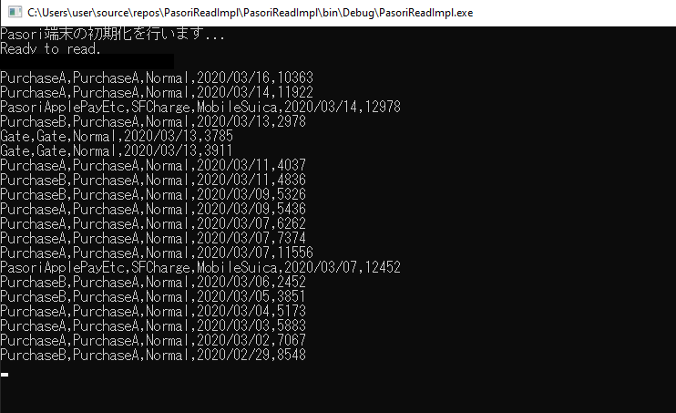

# これは何か
- `felicalib`を利用し、suicaのIdm(識別ID)と利用履歴を表示するコンソールアプリです。
  - `felicalib`はBSDライセンスです
- モチベーション
  - 確定申告でカードリーダを買う羽目になり、折角なので...
- Idmを社員情報などと紐づけてDBと照合なりなんなりすれば、お手軽な入退室管理システムが作れそうです。
  - というか某出退勤システムとかそうなのかもしれません。
- 駅コードやら何やら色々用意されているようですが特に網羅していません。
  - とはいうものの色々調べる必要があったので、以下はその概要およびリファレンスです。

# 動作機序
### 1. コンソールの起動後、PaSoRiデバイスの初期化を行います。
  - このときカードが翳されていると初期化に失敗します。
    - このことから、仮にパソリを利用してシステムを構築する場合オンデマンドに初期化を行うのではなく、システムの起動時に初期化をクリアに完了させておく必要がありそうです。

### 2. 操作に応じてポーリングを行います。
  - このときリーダライタは、カードに対してシステムコードによる問い合わせを行います。
    - 決済系システムコード: Edy, WAON, nanaco
    - 交通系システムコード: Suicaなどサイバネ規格に基づくもの
    - QUICPay
  - システムコード種別が異なるカードが反応することはありません。
    - e.g. リーダがSuicaに対して問い合わせを行っているときに、WAONを翳してもカードは反応しません。
    - ApplePayなど複合型カードを利用して決済処理を行う際、最初にカード種別を選択するのはこのためです。
  - 本実装はSuicaに対するポーリングのみ行います。

### 3. カードを捕捉したならば、対応したサービスコードによる問い合わせを行います。
  - 例として、サイバネ規格であれば以下のようなサービスコードを受け付けます。
    - カード基本情報
      - カード種別、カード内残高情報など
    - 利用履歴(最新20件)
      - 電子マネー決済や入金の履歴を含む
    - 改札入出情報(最新3件)
      - 利用した改札機の情報などを含む
      - 改札内で20回買い物をしたとしても正常に出場できる
      - テンポラリ領域に近く、出場時に履歴に移動する
    - SF入場情報
      - 利用した中間改札の情報などを含む
      - 出場時に消去されない
    - 第三者には読み取ることのできない暗号化データを含みますが、詳細は公開されていません。
      - カード所有者情報など

### 4. 読み取った情報をコンソールに表示します。
  - 何かの間違いで外部からこのコードベースを利用したい場合、本`Program.cs`が利用していない機能が`Suica.cs`に定義されています。

# References
`[PASMO] FeliCa から情報を吸い出してみる - FeliCaの仕様編 [Android][Kotlin]`
https://qiita.com/YasuakiNakazawa/items/3109df682af2a7032f8d

`サイバネ規格 (ICカード) ‐ 通信用語の基礎知識`
https://www.wdic.org/w/RAIL/%E3%82%B5%E3%82%A4%E3%83%90%E3%83%8D%E8%A6%8F%E6%A0%BC%20%28IC%E3%82%AB%E3%83%BC%E3%83%89%29#10CBx20SFxE5x85xA5xE5xA0xB4xE6x83x85xE5xA0xB1

`FeliCa システムコードの切り替えは Polling コマンドのみで【iOS 13 Core NFC】`
https://qiita.com/treastrain/items/04f50a91f70fd6480fc0

`tmurakam/felicalib: Felica library to access PaSoRi http://felicalib.tmurakam.org`
https://github.com/tmurakam/felicalib
